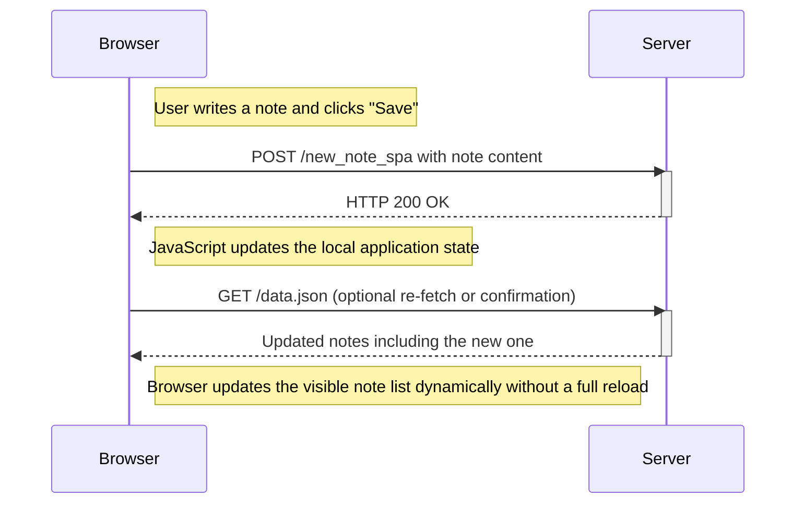

# Sequence Diagram – Creating a New Note in the SPA Version

This diagram illustrates what happens when a user creates a new note in the Single Page Application (SPA) version of the notes app:

https://studies.cs.helsinki.fi/exampleapp/spa

