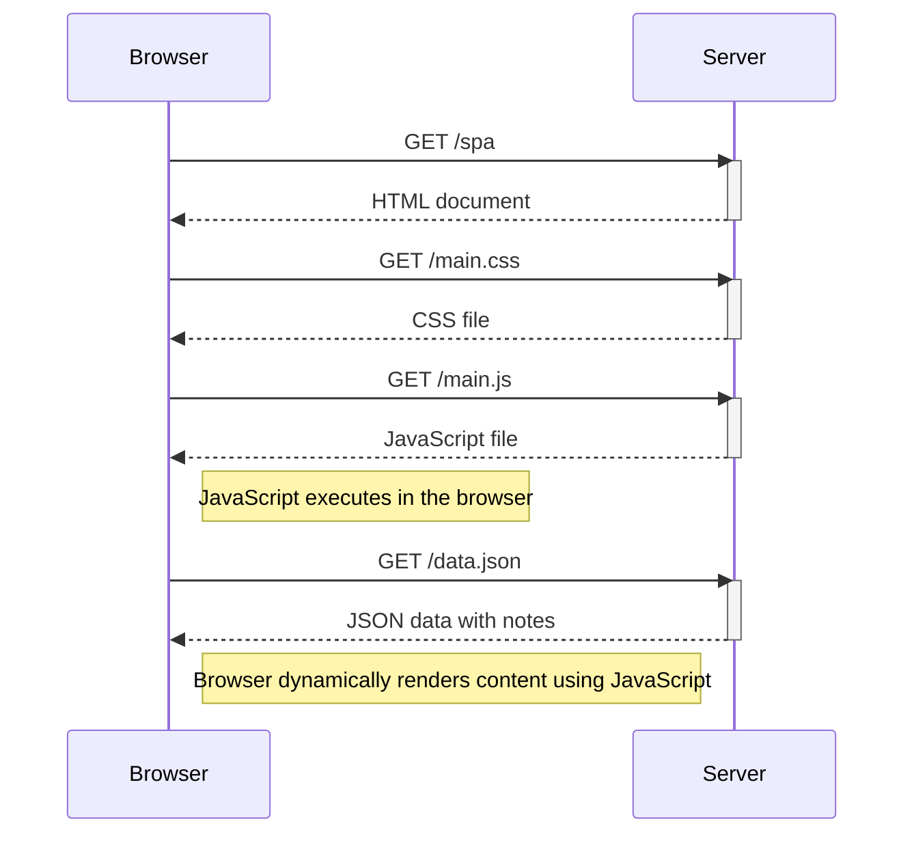

# Sequence Diagram – Visiting the SPA Version

This diagram describes the sequence of events that occurs when a user visits the Single Page Application (SPA) version of the notes app at:

https://studies.cs.helsinki.fi/exampleapp/spa

