# 💡 Sequence Diagram: Creating a New Note

This diagram shows what happens behind the scenes when a user **writes a new note** and clicks the **"Save"** button on  
👉 [https://studies.cs.helsinki.fi/exampleapp/notes](https://studies.cs.helsinki.fi/exampleapp/notes)

The browser communicates with the server to save the note, and then reloads the page to show the updated list of notes.

```mermaid
sequenceDiagram
    participant browser
    participant server

    Note right of browser: 📝 User writes a note and clicks "Save"

    browser->>server: POST /new_note
    activate server
    server-->>browser: HTTP 302 Redirect to /notes
    deactivate server

    browser->>server: GET /notes
    activate server
    server-->>browser: HTML page
    deactivate server

    browser->>server: GET /main.css
    activate server
    server-->>browser: CSS file
    deactivate server

    browser->>server: GET /main.js
    activate server
    server-->>browser: JavaScript file
    deactivate server

    Note right of browser: 🧠 JavaScript runs and fetches saved notes

    browser->>server: GET /data.json
    activate server
    server-->>browser: All notes including the new one
    deactivate server

    Note right of browser: ✅ Notes are re-rendered in the browser
```

